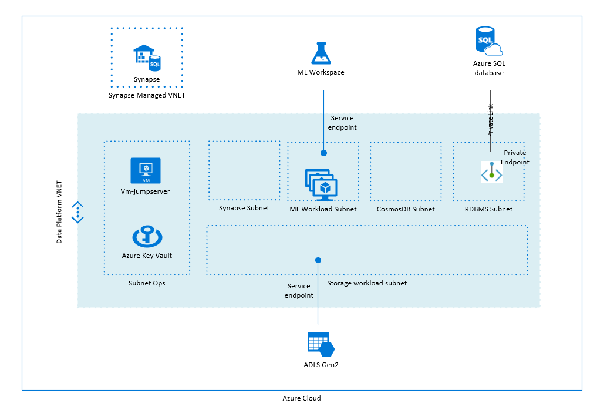

# Introduction to data analytics landing zone

Welcome to Cloud Adoption Framework for Azure: Terraform landing zones.

This landing zone is a starter for data analytics platform that stacks on top of **landingzone_caf_foundations** and **landingzone_networking**

### Data analytics landing zone foundation


### Components
| Examples | Description|
|----------|------------|
|datalake | Create datalake account |
|synapse | Synapse analytics workspace |
|aml | Machine Learning workspace for auto ml |
|module_azure_storage | Re-usable module to create the storage account |

## Prerequisites

This landing zone is a "level 2" type of landing zone, which requires you have set the foundations. The supported lower level landing zone is "landingzone_caf_foundations" which can be found in the same release and must have been applied successfully before applying this one.

## Developping this landing zone

Those are the minimum steps to allow a single devops engineer. 

If the subscription is shared across multiple devops engineer is it recommended each devops engineer use their own launchpad to avoid any conflicts between devops engineers. This can be achieved by setting a specific environment variable value. In the following script we use the environment value of "asia".

Note - the script bellow is not covering a shared environment multiple devops engineer can get access and collaborate (coming later)

```bash
# Login the Azure subscription
rover login -t terraformdev.onmicrosoft.com -s [subscription GUID]
# Environment is needed to be defined, otherwise the below LZs will land into sandpit which someone else is working on
export TF_VAR_environment={Your Environment}
# Add the lower dependency landingzones
rover --clone-landingzones --clone-branch vnext13
# Deploy the launchpad light to store the tfstates
rover -lz /tf/caf/landingzones/launchpad -a apply -launchpad -var location=southeastasia

## To deploy the landing zones, some dependencies are required: caf foundations and networking
rover -lz /tf/caf/landingzones/landingzone_caf_foundations/ -a apply -var-file /tf/caf/configuration/landingzone_caf_foundations.tfvars
rover -lz /tf/caf/landingzones/landingzone_networking/ -a apply -var-file /tf/caf/configuration/landingzone_networking.tfvars 

# Run data landing zone deployment
rover -lz /tf/caf/ -tfstate landingzone_data.tfstate -a apply 
```

## Deleting the development environment

Have fun playing with the landing zone and once you are done, you can simply delete the deployment using:

```bash
rover -lz /tf/caf/ -tfstate landingzone_data.tfstate -a destroy -auto-approve
rover -lz /tf/caf/landingzones/landingzone_networking/ -a destroy -var-file /tf/caf/configuration/landingzone_networking.tfvars
rover -lz /tf/caf/landingzones/landingzone_caf_foundations/ -a destroy -var-file /tf/caf/configuration/landingzone_caf_foundations.tfvars

# to destroy the launchpad you need to conifrm you are connected with your user. If not reconnect with
rover login -t terraformdev.onmicrosoft.com -s [subscription GUID]

rover -lz /tf/caf/landingzones/launchpad -a destroy -launchpad
```

<!--- BEGIN_TF_DOCS --->
## Requirements

| Name | Version |
|------|---------|
| terraform | >= 0.13 |
| azurecaf | ~>0.4.3 |
| azurerm | ~>2.19.0 |

## Providers

| Name | Version |
|------|---------|
| terraform | n/a |

## Inputs

| Name | Description | Type | Default | Required |
|------|-------------|------|---------|:--------:|
| aml\_configs | (Required) Machine learning Configuration objects | `any` | n/a | yes |
| datalake\_configs | (Required) Data Lake Configuration objects | `any` | n/a | yes |
| lowerlevel\_container\_name | n/a | `any` | n/a | yes |
| lowerlevel\_key | n/a | `any` | n/a | yes |
| lowerlevel\_resource\_group\_name | n/a | `any` | n/a | yes |
| lowerlevel\_storage\_account\_name | Map of the remote data state | `any` | n/a | yes |
| synapse\_configs | (Required) Synapse Configuration objects | `any` | n/a | yes |
| tags | (Optional) Tags for the landing zone | `map` | <pre>{<br>  "environment": "DEV",<br>  "project": "my_analytics_project"<br>}</pre> | no |
| tfstate\_landingzone\_caf\_foundations | (Optional) Name of the Terraform state for the caf foundations landing zone | `string` | `"landingzone_caf_foundations.tfstate"` | no |
| tfstate\_landingzone\_networking | (Optional) Name of the Terraform state for the networking landing zone | `string` | `"landingzone_networking.tfstate"` | no |
| vm\_configs | (Required) Virtual Machine Configuration objects | `any` | n/a | yes |
| workspace | n/a | `any` | n/a | yes |

## Outputs

| Name | Description |
|------|-------------|
| dap\_aml\_workspace | Full output of the Azure Machine learning objects |
| dap\_synapse\_workspace | Full output of the Synapse objects |
| datalake\_storage | Full output of the data lake storage objects |
| landingzone\_caf\_foundations\_accounting | Full output of the accounting settings |
| landingzone\_caf\_foundations\_global\_settings | Full output of the global settings object |
| prefix | Prefix |

<!--- END_TF_DOCS --->